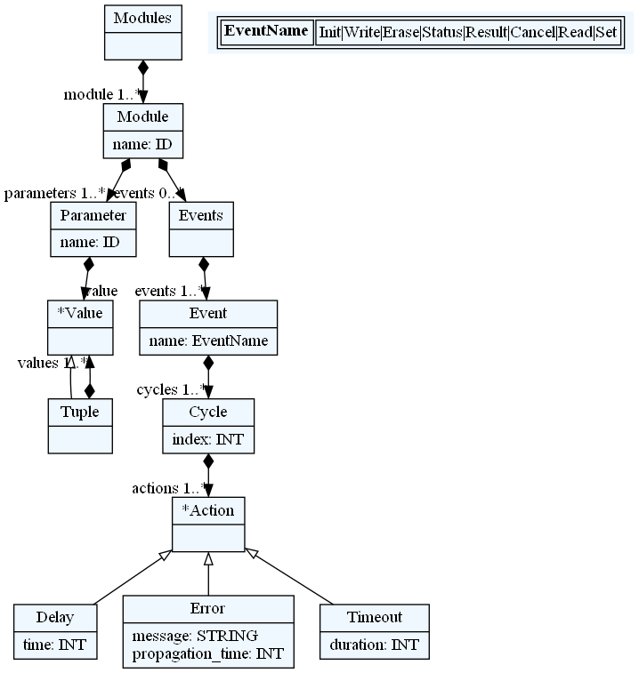
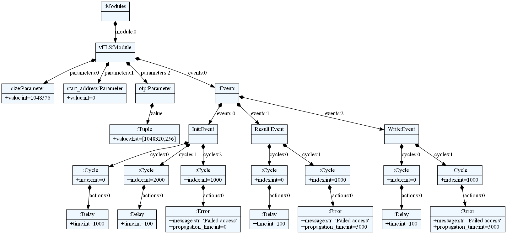
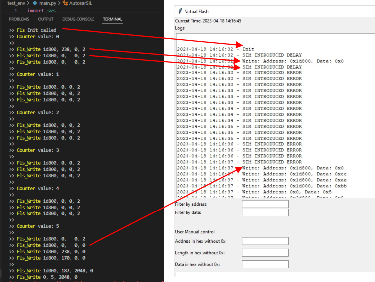

## Software-in-the-Loop for Autosar environment

This project demonstrates how to use Python to test Autosar application using a Software-in-the-Loop (SIL) approach. The Autosar application is compiled as a DLL (Dynamic Link Library) and loaded into the simulation environment. In order to test Autosar application, MCAL layer for specific MCU has to be replaced with the behavioral model called virtual MCAL (vMCAL).
A virtual MCAL (Microcontroller Abstraction Layer) layer is  generated using textX and Jinja2 based on DSL specification, which allows for simulation of the hardware dependencies of the application.

DSL model is written with help of textX meta-language. 
DSL grammar for vMCAL looks like this:

Test example specified in mcal.config file produces this model:

## Dependencies

To use this project, you will need to have the following installed:

* Python 3.x - https://www.python.org/downloads/
* textX      - pip install textX
* Jinja2     - pip install Jinja2

Once you have these dependencies installed, you can clone this repository.

## Setup
* Add events for the vMCAL module in mcal.config file, if you need additional events
* Run mcal generator: "python mcal_generator.py" which will generate needed files in src_gen for your Autosar application and python SIL environment.
* Add your Autosar application DLL path in config.ini file
* Run main.py script: "python main.py". This will open Terminal and graphical view of the vMCAL modules.

## Example from mcal.config specification

## Generating the Virtual MCAL Layer with other MCAL components

To generate additional components in the virtual MCAL layer, you will need to modify the mcal.config file. This file specifies the structure of the virtual MCAL layer using the textX syntax. Once you have modified this file, you can run the mcal_generator.py script. This script uses textX and Jinja2 to generate the virtual MCAL layer code.

## Usage notes

* To use this project, you will need to provide an Autosar application as a shared library (currently DLL only supported).
* Autosar application needs to be compiled with vMCAL *.c and *.h files provided in src and src_gen folder.\
  In folder src are static files which are calling generated vMCAL functions for every MCAL component.
* Make sure to implement the "start_application" function in your Autosar application. This is nessesary to synhronize both Python and C application before simulation starts.\
 C function declaration: \
__declspec(dllexport) void start_application(void){\
}\
Here you can add a blocking semaphore which you can use to wait in a loop until semaphore is set or cleared, depending on your logic. 
Python application will call start_application and you can set/clear a semaphore to continue C application execution.
* The main.py script will load the DLL to execute the application in the SIL environment.

## Portability
* Current limitation: DLL files only for Autosar application.
* TODO: Linux support and *.so files.

## License

This project is licensed under the MIT License - see the LICENSE file for details.

